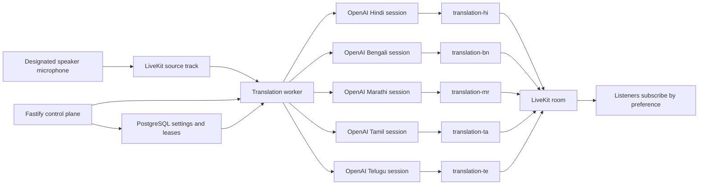

# Realtime Voice Translation Implementation Plan

Status: Proposed implementation plan  
Initial provider: OpenAI  
Initial model: `gpt-realtime-translate`  
Initial source language: English  
Initial target languages: Hindi (`hi`), Bengali (`bn`), Marathi (`mr`), Tamil (`ta`), and Telugu (`te`)

## 1. Product scope

The first release is listen-along interpretation for meetings with one designated speaker, initially the host. Participants continue watching the same LiveKit room and independently choose either the speaker's original audio or one of five translated audio tracks.

The five-language list is the proposed starting set. Before enabling a language in production, we must run the language-quality gate described in Phase 1 because OpenAI's public translation guide does not publish a guaranteed quality matrix for every Indian language.

### Included in the first release

- One designated source speaker at a time.
- English source speech.
- Hindi, Bengali, Marathi, Tamil, and Telugu output.
- One translated audio track shared by every listener selecting the same language.
- Source and translated captions.
- Automatic fallback to the source speaker's original audio.
- Host controls to enable or disable interpretation.
- Participant control to select Original or one translated language.
- Translation status, latency, failure, and usage metrics.
- No raw-audio recording; finalized source transcript segments are retained while the meeting
  worker is active.

### Deliberately deferred

- Translating every participant simultaneously.
- Automatic speaker switching.
- Translation between all pairs of the five Indian languages.
- Voice cloning or matching the source speaker's voice.
- User-selectable synthetic voices.
- Recorded translated tracks.
- Provider switching in the meeting UI.

## 2. OpenAI API decisions

Use the dedicated translation model and endpoint:

- Model: `gpt-realtime-translate`
- Transport: server-to-server WebSocket
- URL: `wss://api.openai.com/v1/realtime/translations?model=gpt-realtime-translate`
- Input: continuously streamed, base64-encoded 24 kHz PCM16 audio
- Output: translated PCM audio deltas, source transcript deltas, and translated transcript deltas
- Session cardinality: one OpenAI translation session per active output language

This is not a normal Realtime voice-agent conversation. Do not call `response.create`. Translation begins from the continuous audio stream itself. Silence between phrases must also be forwarded so the stream maintains natural timing.

The worker configures each WebSocket after opening:

```json
{
  "type": "session.update",
  "session": {
    "audio": {
      "output": {
        "language": "hi"
      }
    }
  }
}
```

Input frames use:

```json
{
  "type": "session.input_audio_buffer.append",
  "audio": "<base64-pcm16>"
}
```

The worker handles these output events:

- `session.output_audio.delta`
- `session.output_transcript.delta`
- `session.input_transcript.delta`
- `session.closed`
- documented error and rate-limit events

When a stream ends, the worker sends `session.close`, stops appending audio, drains remaining output, and waits for `session.closed` before closing the socket.

Official references:

- [Realtime translation guide](https://developers.openai.com/api/docs/guides/realtime-translation)
- [`gpt-realtime-translate` model](https://developers.openai.com/api/docs/models/gpt-realtime-translate)
- [Realtime WebSocket guide](https://developers.openai.com/api/docs/guides/realtime-websocket)
- [Realtime cost guide](https://developers.openai.com/api/docs/guides/realtime-costs)

## 3. System architecture



The Fastify API is the control plane. It must never process the live PCM stream. A new dedicated worker is the media plane.

## 4. Translation worker

Create `apps/translation-worker` as a Node.js/TypeScript workspace application.

### Responsibilities

1. Claim one queued translation run using a PostgreSQL lease.
2. Join the LiveKit room as a backend participant with role `translator`.
3. Remain hidden from the normal participant list and count.
4. Subscribe only to the designated speaker's microphone publication.
5. Convert LiveKit audio to mono 24 kHz PCM16.
6. Maintain one OpenAI WebSocket for each active target language.
7. Forward the same source frames to every active language session.
8. Receive and decode translated audio deltas.
9. Pace translated PCM into one LiveKit audio source per language.
10. Publish translated captions and health messages.
11. Record metrics and heartbeat state.
12. Gracefully drain OpenAI sessions when interpretation stops or the meeting ends.

### Suggested worker modules

```text
apps/translation-worker/src/
  config.ts
  main.ts
  jobs/translation-job-runner.ts
  livekit/room-bridge.ts
  livekit/translation-track-publisher.ts
  audio/pcm-resampler.ts
  audio/frame-pacer.ts
  audio/bounded-audio-queue.ts
  openai/openai-translation-session.ts
  sessions/language-session-manager.ts
  control/data-message-handler.ts
  metrics/translation-metrics.ts
```

### Audio pipeline

```text
LiveKit decoded speaker audio
  -> mono conversion
  -> resample to 24 kHz PCM16
  -> 20 ms frames
  -> base64 WebSocket append events
  -> OpenAI translated PCM deltas
  -> bounded per-language jitter queue
  -> resample if required by LiveKit AudioSource
  -> paced LiveKit translated track
```

Requirements:

- Preserve silence frames rather than applying client-side VAD.
- Use bounded queues; never allow delay to grow indefinitely.
- Track source timestamp, translated-output timestamp, and queue depth.
- If queued translated audio exceeds four seconds, mark the language delayed and recover by discarding stale queued output or restarting the language session.
- Never block the source audio subscription while one language is slow.
- Give every language its own output queue and failure state.

## 5. Language-session lifecycle

Each language session has these states:

```text
idle -> starting -> live -> delayed/reconnecting -> live -> draining -> closed
                                      \-> failed
```

Rules:

- Start a language only when the first listener selects it.
- Reuse the same session and LiveKit track for all additional listeners.
- When the last listener leaves, start a 30-second grace timer.
- Cancel the timer if a listener reselects the language.
- After the grace period, send `session.close`, drain output, unpublish the track, and record usage.
- Stop all sessions immediately when the host disables interpretation, but drain already translated audio before final cleanup where practical.
- Stop all sessions when the meeting ends or the speaker track is permanently unpublished.
- During an OpenAI reconnect, instruct clients to play original audio.
- Use exponential retry with jitter and a strict maximum retry window; do not retry indefinitely.

## 6. LiveKit contracts

### Worker identity

```text
translation-worker:<meeting-id>:<run-id>
```

Worker participant attributes:

```json
{
  "role": "translator",
  "meetingId": "...",
  "translationRunId": "...",
  "hidden": "true"
}
```

### Track names

- `translation-hi`
- `translation-bn`
- `translation-mr`
- `translation-ta`
- `translation-te`

Each publication must carry metadata identifying the source participant, target language, run, and generation number so a stale publication is never mistaken for the current stream.

### Reliable data messages

Client to worker:

- `translation.preference.set`
- `translation.preference.clear`

Worker to client or room:

- `translation.preference.ack`
- `translation.language.status`
- `translation.caption.source.delta`
- `translation.caption.source.final`
- `translation.caption.target.delta`
- `translation.caption.target.final`
- `translation.worker.status`

Every message includes `version`, `meetingId`, `translationRunId`, `sequence`, and `sentAt`. The worker validates that the sender is an actual room participant and that the requested language is enabled for the meeting.

Participant language preference remains ephemeral room state. The client resends it after reconnecting. Do not persist a row for every preference change.

## 7. Web application changes

### New UI

Add an Interpretation control to the bottom meeting panel:

- Original
- हिन्दी
- বাংলা
- मराठी
- தமிழ்
- తెలుగు

Host Tools gets an Interpretation section:

- Enable interpretation
- Spoken language: English
- Allowed output languages
- Designated speaker
- Active translated languages and listener counts
- Worker status
- Stop interpretation

### Audio playback refactor

The current `RoomAudioRenderer` automatically plays all subscribed room audio. It cannot remain responsible for all audio after translated tracks are introduced because listeners would hear both the original and translated speaker.

Create a selective audio renderer that:

- Plays all ordinary participant microphones normally.
- Treats the designated speaker separately.
- Plays either the designated speaker's original track or the selected translation track, never both at full volume.
- Immediately restores original audio when translation becomes unavailable.
- Ignores translation tracks for languages the participant did not select.
- Prevents the translation worker from appearing in the grid or participant count.
- Restores the preference and subscription after LiveKit reconnects.

Recommended components:

```text
apps/web/src/components/interpretation/
  InterpretationMenu.tsx
  InterpretationStatus.tsx
  TranslationCaptions.tsx
  SelectiveRoomAudioRenderer.tsx
  useInterpretationPreference.ts
  useTranslationTracks.ts
```

### Client-visible states

- Original audio
- Starting Hindi...
- Hindi live
- Translation delayed; playing original audio
- Reconnecting; playing original audio
- Hindi unavailable
- Interpretation stopped by host

## 8. API and database

Add migration `database/migrations/005_add_meeting_translation.sql`.

### `meeting_translation_settings`

- `meeting_id` primary key and foreign key
- `enabled`
- `source_language`
- `allowed_target_languages`
- `provider`
- `model`
- `designated_speaker_identity`
- `updated_by_user_id`
- `created_at`
- `updated_at`

### `meeting_translation_runs`

- `id`
- `meeting_id`
- `status`
- `worker_instance_id`
- `lease_expires_at`
- `speaker_participant_identity`
- `started_at`
- `ended_at`
- `last_heartbeat_at`
- `error_code`
- `error_detail` with secrets and transcript text excluded

Add a database constraint or partial unique index ensuring only one queued/starting/active run exists for a meeting.

### `meeting_translation_language_usage`

- `run_id`
- `target_language`
- `started_at`
- `ended_at`
- `billed_audio_seconds`
- `reconnect_count`
- `first_audio_latency_ms_p50`
- `first_audio_latency_ms_p95`
- `max_queue_depth_ms`
- `failure_code`

### API routes

- `GET /api/meetings/:meetingId/translation`
- `PATCH /api/meetings/:meetingId/translation`
- `POST /api/meetings/:meetingId/translation/start`
- `POST /api/meetings/:meetingId/translation/stop`
- `GET /api/meetings/:meetingId/translation/status`

Only the host can change settings or start and stop interpretation. Guests receive the public configuration and runtime status but never OpenAI credentials.

## 9. Shared types

Add `packages/shared/src/translation.ts` and export it from `packages/shared/src/index.ts`.

Include:

- `TranslationLanguageCode = "hi" | "bn" | "mr" | "ta" | "te"`
- Language labels and native labels
- `MeetingTranslationSettings`
- `MeetingTranslationStatus`
- `TranslationLanguageStatus`
- Versioned data-message schemas
- API request and response types
- Runtime validation schemas for every untrusted data message

## 10. Configuration and secrets

Worker-only environment variables:

```text
OPENAI_API_KEY=
OPENAI_REALTIME_TRANSLATION_MODEL=gpt-realtime-translate
TRANSLATION_MAX_LANGUAGES=5
TRANSLATION_LANGUAGE_IDLE_GRACE_MS=30000
TRANSLATION_MAX_QUEUE_MS=4000
TRANSLATION_WORKER_HEARTBEAT_MS=5000
TRANSLATION_WORKER_LEASE_MS=20000
```

The API key must never be placed in Vite variables, browser bundles, meeting tokens, LiveKit metadata, logs, or API responses. Send an `OpenAI-Safety-Identifier` derived from a stable one-way hash of the owning account ID rather than raw personal information.

## 11. Cost and capacity controls

OpenAI currently lists `gpt-realtime-translate` at $0.034 per audio minute, billed by duration. That is approximately:

- One active language for one hour: $2.04
- Five active languages for one hour: $10.20

These are provider costs before infrastructure and may change. Verify pricing before release.

Cost scales with active languages, not listeners. Therefore:

- Do not open all five sessions when interpretation is enabled.
- Open a session only for a language with at least one listener.
- Display active language-hours in internal metrics.
- Apply account and meeting budgets.
- Add a hard five-language maximum.
- Alert at 70%, 85%, and 95% of the OpenAI audio-minute rate limit.

The model page lists limits in minutes of audio per minute. Capacity planning must use active language sessions as the primary unit. At five active languages, one meeting consumes roughly five audio-minutes of quota per wall-clock minute.

## 12. Failure behavior

| Failure | Required behavior |
| --- | --- |
| Worker has not joined | Interpretation control shows Starting; original audio remains active |
| OpenAI session cannot start | Only that language becomes unavailable |
| OpenAI WebSocket disconnects | Fall back to original, retry with bounded backoff |
| Translated output queue exceeds four seconds | Mark delayed, return to original, recover or restart session |
| Worker heartbeat expires | API marks run stale and permits a replacement worker to claim it |
| Speaker changes or microphone is unpublished | Drain current sessions, pause interpretation, wait for a valid source track |
| Meeting ends | Close all translation sessions and disconnect worker |
| Client reconnects | Play original, resend preference, switch after selected track is live |
| Invalid data message | Ignore, count, and rate-limit; never crash the worker |

## 13. Privacy and UX requirements

- Show a pre-join and in-meeting notice that speech is processed by an automated translation service.
- State that translations may contain mistakes.
- Do not store raw audio.
- Store only finalized source transcript text, expose it only to the meeting owner, and delete it
  when the meeting is deleted.
- Do not log transcript contents.
- Encrypt traffic in transit to both LiveKit and OpenAI.
- Use stock/default translation audio; do not imply it is the speaker's real voice.
- Always offer Original audio.
- Make fallback automatic and visible.

## 14. Implementation phases

### Phase 0 - Contracts and test harness

- [ ] Confirm the five proposed target languages.
- [ ] Add shared language and event schemas.
- [ ] Define track naming and metadata.
- [ ] Build a fake translation provider that delays and echoes PCM.
- [ ] Prepare English golden audio containing names, dates, amounts, acronyms, and Indian place names.
- [ ] Record the acceptance metrics before writing OpenAI-specific code.

Exit: the fake provider can drive the complete worker and client contract without an OpenAI key.

### Phase 1 - OpenAI language feasibility spike

- [ ] Connect a Node WebSocket to `/v1/realtime/translations`.
- [ ] Stream 24 kHz PCM16 continuously.
- [ ] Capture output audio and source/target transcript deltas.
- [ ] Test `hi`, `bn`, `mr`, `ta`, and `te` individually.
- [ ] Confirm each requested language code is accepted.
- [ ] Have bilingual reviewers score meaning, naturalness, names, and numbers.
- [ ] Measure first-audio and end-of-utterance latency.
- [ ] Confirm graceful `session.close` behavior.

Exit: every enabled language passes the quality gate. A language that fails remains behind a feature flag rather than blocking the rest.

### Phase 2 - LiveKit worker vertical slice

- [ ] Create `apps/translation-worker`.
- [ ] Join a room as a hidden translator participant.
- [ ] Subscribe to the host microphone only.
- [ ] Convert LiveKit audio to OpenAI PCM format.
- [ ] Start Hindi on demand.
- [ ] Publish `translation-hi` into LiveKit.
- [ ] Filter the worker from the UI.
- [ ] Stop cleanly when the meeting ends.

Exit: host English speech is heard as Hindi by two listeners through one shared LiveKit track for at least 15 minutes without growing delay.

### Phase 3 - Selective client playback

- [ ] Replace automatic room-wide audio rendering with selective rendering.
- [ ] Add Original/Hindi selection.
- [ ] Prove that listeners never hear duplicate full-volume speaker audio.
- [ ] Add automatic original-audio fallback.
- [ ] Restore the preference after reconnect.
- [ ] Add captions and runtime states.

Exit: switching Original/Hindi does not reconnect the room and fallback occurs within one second.

### Phase 4 - Five-language lifecycle

- [ ] Add Bengali, Marathi, Tamil, and Telugu.
- [ ] Add per-language listener reference counting.
- [ ] Add lazy session startup.
- [ ] Add the 30-second idle grace period.
- [ ] Isolate per-language queues and failures.
- [ ] Add host controls and allowed-language settings.

Exit: all five language sessions can operate concurrently; a failure in one does not interrupt the others.

### Phase 5 - Persistence and orchestration

- [ ] Add migration 005.
- [ ] Add host-only translation routes.
- [ ] Add queued runs, leases, heartbeats, and stale-run recovery.
- [ ] Add meeting-end cleanup.
- [ ] Add worker to local development and Docker Compose.
- [ ] Add configuration validation and secret redaction.

Exit: restarting the worker recovers an active meeting safely without producing two workers or duplicate tracks.

### Phase 6 - Observability and cost controls

- [ ] Record active language-seconds.
- [ ] Record first-audio latency p50/p95.
- [ ] Record queue depth and drift.
- [ ] Record reconnects and provider errors by code.
- [ ] Add budget and rate-limit guards.
- [ ] Add structured health/status output without transcript contents.

Exit: operators can identify whether a problem is source media, worker processing, OpenAI, LiveKit publication, or client playback.

### Phase 7 - Release validation

- [ ] Run a 30-minute soak test for every language.
- [ ] Run a five-language concurrent soak test.
- [ ] Test fast speech, accents, silence, interruptions, and code-switching.
- [ ] Test names, phone numbers, dates, currencies, and technical vocabulary.
- [ ] Test host disabling interpretation and ending the meeting.
- [ ] Test worker and OpenAI disconnects.
- [ ] Test multiple listeners sharing each translated track.
- [ ] Complete privacy and consent review.

Exit: every release gate below passes.

## 15. Release gates

- Median speech-to-first-translated-audio latency below 2.5 seconds.
- p95 speech-to-first-translated-audio latency below 4 seconds.
- No continuously growing backlog in a 30-minute meeting.
- Original-audio fallback begins within one second of a translation failure.
- One published track per active language, regardless of listener count.
- Average bilingual meaning score at least 4/5 per enabled language.
- Names, dates, and numbers preserved at least 95% on the golden set.
- No OpenAI key or transcript text appears in browser assets, API responses, or logs.
- Ending a meeting closes and drains all OpenAI sessions.
- Translation-worker participants never appear in the user-facing participant list or count.

## 16. Recommended build order

Do not begin with the final UI. Build in this order:

1. Shared contracts and deterministic fake provider.
2. OpenAI WebSocket feasibility for each language.
3. LiveKit source subscription and translated publication for Hindi.
4. Selective client audio playback and fallback.
5. Five-language session manager.
6. Host controls and participant language menu.
7. Database orchestration and recovery.
8. Metrics, soak tests, quality review, and controlled rollout.

This order addresses the two highest technical risks first: Indian-language output quality and reliable low-latency PCM bridging between LiveKit and OpenAI.
